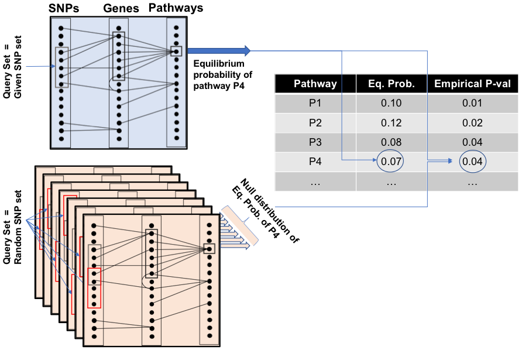

# VarSAn - Variant Set Annotator

Xiaoman Xie [xiaoman2@illinois.edu] and Saurabh Sinha

University of Illinois Urbana-Champaign

VarSAn will be available at http://veda.cs.uiuc.edu/VarSAn/ as an online tool soon.

## Table of Contents
1. [Introduction](#introduction)
2. [Installation](#installation)
3. [Tutorial](#tutorial)
4. [Acknowledgments and credits](#acknowledgments-and-credits)


## Introduction
Genotype-to-phenotype studies continue to identify sets of genomic variants associated with diseases, e.g., through GWAS, cataloging of somatic mutations in cancer, or identification of de novo mutations from family-based studies. There is a pressing need to interpret these variants mechanistically, e.g., through characterization of molecular pathways impacted by them. Such insights are especially useful in studies of complex diseases where no single variant explains etiology. Here we present a computational tool called ‘VarSAn’ (Variant Set Analysis) that uses a powerful graph mining algorithm to identify pathways relevant to a given set of variants. VarSAn aggregates diverse information about the user-provided collection of variants, along with prior knowledge about genes and pathways, to provide systems-level insights into those variants. 

VarSAn uses a pre-built and configurable heterogeneous network whose nodes represent SNPs,  genes and pathways, and edges represent relationships among these entities. The network includes: (1) SNP-gene relationships based on expression quantitative trait loci (eQTL) studies, protein activity impact prediction and genomic proximity, (2) gene-gene relationships based on known interactions among encoded proteins, and (3) gene-pathway membership. VarSAn then takes a “query set” of variants and uses the Random Walk with Restarts algorithm on the network to rank pathway nodes for relevance to the query set, reporting p-values for pathway relevance. 



 
[Return to TOC](#table-of-contents)

## Installation
Please first clone this repository from Github: 
```
git clone https://github.com/UIUCSinhaLab/VarSAn.git
```
Please also download the edges in the network from: [data.zip] (https://drive.google.com/file/d/1au0Pt4xWyxsqHtWWCciS17pcY1srjoDz/view?usp=sharing) The data directory should be unzipped and placed in the downloaded repository.

## Tutorial
This section of the README is meant to walk a user through the process of using VarSAn to find pathways that relate to a SNP set of interest. In these examples, we will examine a query set of 798 SNPs.

###  Creating SNP Query Set
The first step is to create a file that includes the SNPs in the query set. This query set file format should list one SNP on each row with SNPs formatted as 'chromosome_location'. For example, the [sample query set file](gene_sets/SampleQuery.txt) contains:
```
chr10_121589810
chr2_217098337
chr2_217056046
chr12_28021884
```
Please put the query file in the gene_sets folder as the sample query set file.

### Run VarSAn
VarSAn should be called using the command:
```
./run_all.sh <snplist> <all> <pathway database> <gene-gene network> <weight> <number of random query set>
```
| Argument| Description |Accepted Value|
| :---:        |     :---:      |          :---: |
| snplist | The filename of the file with query set variants. File extension should be excluded. For example, "SampleQuery" instead of "SampleQuery.txt" should be passed. |e.g. "Sample Query"|
| all| Specify the tissue for tissue-specific mode or use "all" to run VarSAn in the pan-tissue mode.|all, tissue from the [list](TissueList.txt)|
| pathway database | Pathway Database. Only Reactome pathways are supported in the Github version. |"Reactome"|
|weight|If variants in the query set should be weighted according to the number of connections to control for linkage disequilibrium among non-coding SNPs.|"1" or "0"|
|number of random query set|The number of random query sets used to provide a background distribution for the empirical p-value calculation. A higher empirical p-value resolution can be achieved by increasing the number of random query sets, but which would also require longer running time.|Any integer, we recommend to use numbers greater than 20.|

A sample command could be:
```
./run_all.sh SampleQuery Breast_Mammary_Tissue Reactome yes 1 10
```

## Acknowledgments and Credits
Edges in the downloadable network include SNP-gene edges. 
* For non-coding SNPs, these are based on SNP associations with genes revealed by eQTL analysis from the GTEx project: https://gtexportal.org/home/. We utilized publicly available eQTL data from https://storage.googleapis.com/gtex_analysis_v8/single_tissue_qtl_data/GTEx_Analysis_v8_eQTL.tar
* For coding SNPs, edges are based on variants designated by PolyPhen 2.0 (PMID 20354512) as being "probably damaging" or "possibly damaging". These designations were obtained from the Ensembl database ensembldb.ensembl.org.

Edges in the downloadable network include gene-pathway edges. These are based on pathway membership information according to the REACTOME database https://reactome.org/. 

Edges in the downloadable network include gene-gene edges. These are based on protein-protein interactions according to the HumanNet database (https://www.inetbio.org/humannet/) and were obtained from https://knoweng.org/kn-overview/ 


